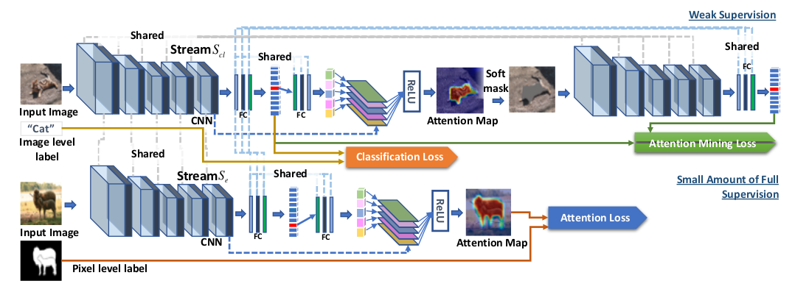
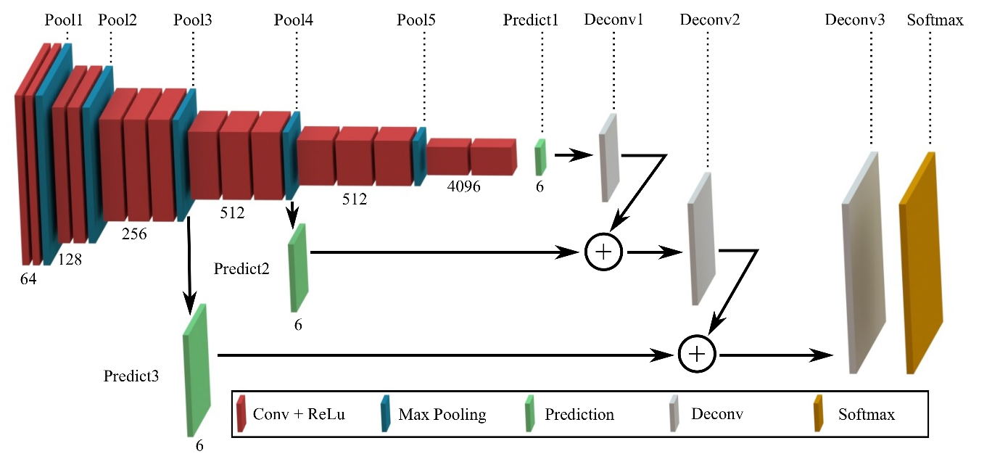
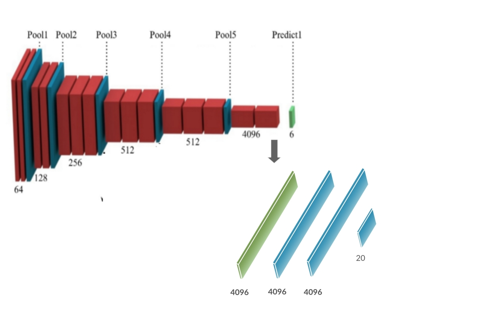
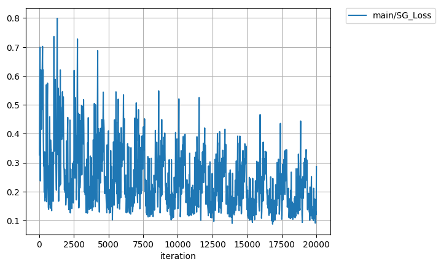
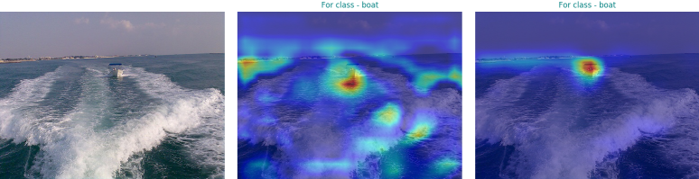
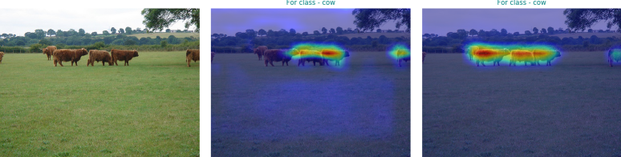
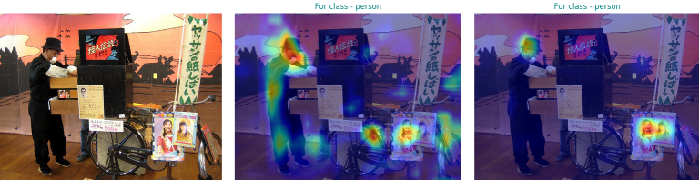
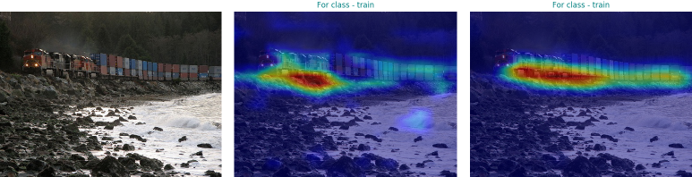

# Guided Attention for FCN

## About
Chainer implementation of <a href='https://arxiv.org/abs/1802.10171'>Tell Me Where To Look</a>.
This is an experiment to apply Guided Attention Inference Network(GAIN) as presented in the paper to Fully Convolutional Networks(FCN) used for segmentation purposes. The trained FCN8s model is fine tuned using guided attention.

## GAIN
 GAIN is based on supervising the attention maps that is produced when we train the network for
the task of interest.


## FCN
Fully Convolutional Networks is a network architecture that consists of convolution layers followed by deconvolutions to
give the segmentation output


## Approach

* We take the fully trained FCN8 network and add a average pooling and fully connected layers after its convolutional layers. We freeze the convolutional layers and
train the fully connected networks to classify for the objects. We do this in order to get GradCAMs for a particular class to be later used during GAIN



* Next we train the network as per the GAIN update rule. However in this implementation I have also  considered the segmentation loss along with the
GAIN updates/loss. This is because, I found using only the GAIN updates though did lead to convergence of losses, but also resulted in quite a significant dip in segmentation accuracies. In this step, the fully connected ayers are freezed and are not updated.

## Loss Curves
### For classification training


### Segmentation Loss during GAIN updates



## Qualitative Results
| Original Image | PreTrained GCAMs | Post GAIN GCAMs |










## Quantitative Results


### For FCN8s

| Implementation | Accuracy | Accuracy Class | Mean IU | FWAVACC | Model File |
|:--------------:|:--------:|:--------------:|:-------:|:-------:|:----------:|
| [Original](https://github.com/shelhamer/fcn.berkeleyvision.org/tree/master/voc-fcn8s) | 91.2212 | 77.6146 | 65.5126 | 84.5445 | [`fcn8s_from_caffe.npz`](https://drive.google.com/uc?id=0B9P1L--7Wd2vb0cxV0VhcG1Lb28) |
| Experimental| 90.5962 | **80.4099** | 64.6869 | 83.9952 | **To make public soon** |

## How to use
```bash
pip install chainer
pip install chainercv
pip install cupy
pip install fcn
```
Training
--------
<s> For training the classifier, <a href='https://drive.google.com/uc?id=0B9P1L--7Wd2vWG5MeUEwWmxudU0'>download</a>. the pretrained FCN8s chainer model </s>
```bash
python3 train_classifier.py --device 0
```
This will automatically download the pretrained file and train the classifier on it. You might run into an error of " xxx.txt file not found " while running this script. To solve this, at the place where your `fcn` library is installed, get the missing file from the <a href='https://github.com/wkentaro/fcn'>fcn</a> repository over github, and take care to put the exisiting file by making the same directory structure as asked in the error message. For more details, refer to this <a href='https://github.com/wkentaro/fcn/issues/111'>issue</a>


For GAIN updates,
```bash
python3 train_GAIN.py --modelfile <path to the trained model with trained classifier> --device 0
```

The accuracy of original implementation is computed with (`evaluate.py <path to the trained fcn8 model>`) which has been borrowed from wkentaro's <a href='https://github.com/wkentaro/fcn'>implementation</a>

Visualization
-------------
```bash
visualize.py 
```
required arguements - 
 ```
  --pretrained <path to the model file with trained classifier but not trained through GAIN method>
  --trained <path to the model trained with GAIN>
 ```

optional arguements - 
```
  --device=-1 <device to assign to model, default uses cpu>
  --whole=False < whether to test on whole valid dataset>
  --shuffle=False <shuffles fataset loader>
  --no=10 <if whole is False, then no of images to visualize>
```

## To Do

- [x] Push Visualization Code

## Using GAIN for other models
I have attempted to make GAIN as modular as possible so that it can be used on some other model as well. All you would need to do is make GAIN class( which itself inherits chainer.Chain) as parent class to your model. 
Each GAIN model needs to have a few particular instance variables in order to be able to function. GAIN module has methods to instantiate every single one of them. I would advice you to lookup ```models/fcn8.py``` as well as ```GAIN.py``` to have an idea about them.

* GAIN_functions - An ordered dict consisting of names of steps and it's associated functions. 
* final_conv_layer - Name of the step after which no convolutions happen
* grad_target_layer - Name of the step from where gradients are to be collected for computing GradCAM


## Credits
The original FCN module and the fcn package is courtesy of <a href='https://github.com/wkentaro/fcn'>wkentaro</a>

## Citation
If you find this code useful in your research, please consider citing:

    @misc{Alok2018,
	Author = {Bishoyi, Alok Kumar},
	Title = {Guided Attention Inference Network},
	Year = {2018},
	Publisher = {GitHub},
	journal = {Github repository},
	howpublished = {\url{https://github.com/alokwhitewolf/Guided-Attention-Inference-Network}},
    }
